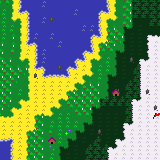

# Procedural Generated Pixel Art Maps
> I created this project as a hobby and learn something about pelin noise and wave function collapse algorithms.
> Project [_here_](https://github.com/Skamlo/Procedural-Generated-Pixel-Art-Maps.com)

## General Information
I wrote a program to create procedurally generated pixel art maps. The project contains only one class - `mapGenerator`, which contains one public function to generating maps - `generate()`.
Durning generating maps we can modulate some parameters:

`size`: list, default: (20, 20) 
- number of segments
- (x, y) or (numberOfRows, numberOfColumns)
    
`pixelsPerSegment`: int, default: 8 

`biomSizeMultiplayer`: float, default: 1.0 

`forestSizeMultiplayer`: float, default: 1.0 

`forestDensity`: float, default: 0.5 
- value between 0 and 1
- 1 is max of density
- 0 is min

`heightIndicator`: float, default: 0.5 
- value between 0 and 1
- greater value = more hills and mountains
- smaller value = more seas and meadows

`seed`: int, default: None 

And finally we getting maps like this:

## Technologies Used
-numpy - version 1.22.2

-Pillow - version 9.0.1

-perlin_noise - version 1.12

## Setup
If you want to run this program you have to install three packages - `numpy`, `Pillow` and `perlin_noise`. You can do it with pip method by typing `pip install scikit-learn customtkinter` cammand in system console.

## Contact
email: maksymiliannorkiewicz@gmail.com
